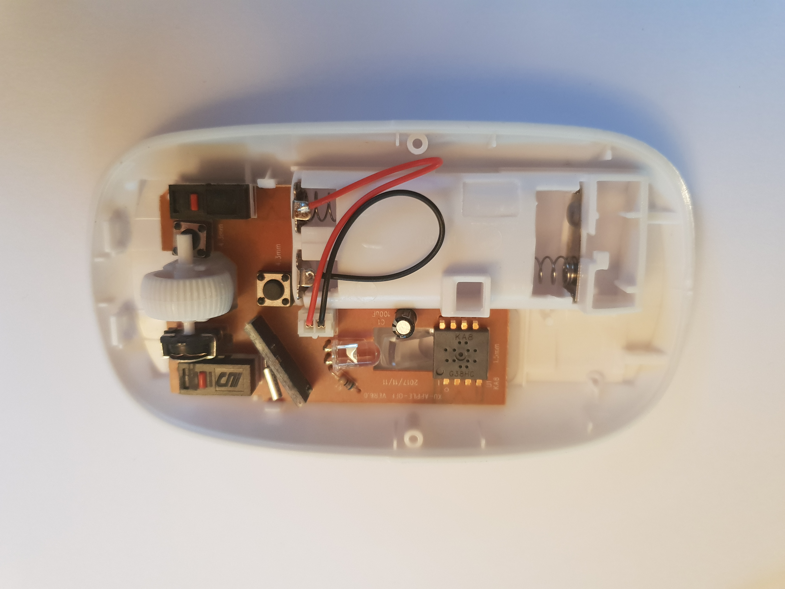

# Mouse-Sensor-Hack

---

Welcome to Mouse Sensor hack project,

Created by [Jean Perardel](http://www.instructables.com/member/jeanotP1314/) from [Lab_1314](https://www.youtube.com/watch?v=qNliaFjvuI0&t=1s).

Status: *** In development ***

---

## Content

In this project, I will play with several mouse sensors and try to get the mouvement register as well as the camera (when possible)

I will start with the ADNS-3050 because it's a well known architecture. Then I will try to read some KA8 sensors we commonly find in cheap Ebay mouses like this one: 

## UPDATE 28/02/2019
The KA8 / PAW3204DB code is now fully functional. It can read the register and display mouvement. On this chip, it's not possible to have access to the pixels through register, so I will focus on ADNS-2610 now !