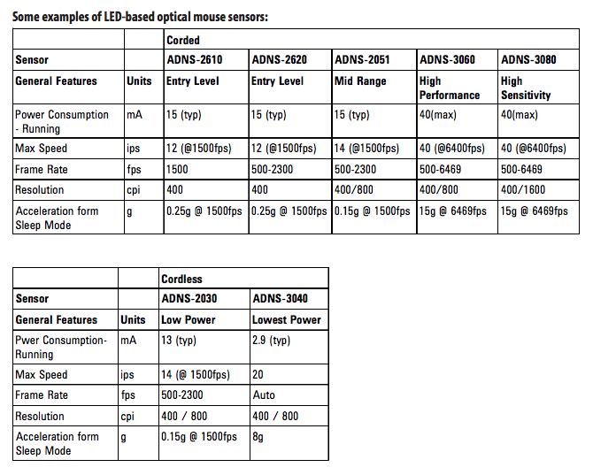

# Mouse-Sensor-Hack

---

Welcome to Mouse Sensor hack project,

Created by [Jean Perardel](http://www.instructables.com/member/jeanotP1314/) from [Lab_1314](https://www.youtube.com/watch?v=qNliaFjvuI0&t=1s).

Status: *** In development ***

---

## Content

In this project, I will play with several mouse sensors and try to get the mouvement register as well as the camera (when possible)

I will start with the ADNS-3050 because it's a well known architecture. Then I will try to read some KA8 sensors we commonly find in cheap Ebay mouses like this one: 

## UPDATE 25/03/2019
The ADNS-3050 is functional to read positions but I have a problem with camera datas. 
The KA8 / PAW3204DB is functional to read position
I just received some new ADNS from Ebay : 
	ADNS-2610 (I actually had one already, but I was waiting for the 24MHz quartz)
	ADNS-3080
	ADNS-5020
	ADNS-9800 This one is for drone, not for mouses... but it's still interesting to check how it works

Here is a little recap tab to understand the differences : 

(from https://www.bidouille.org/files/hack/mousecam/Understanding%20Optical%20Mice%20White%20Paper.pdf )

I also started to check the 2.4GHz RF communication between cheap mouses bought on Ebay and their USB dongle. I use some NRF24L01 to read the communication 
Some interesting work has been done with remote keyboard :
	https://github.com/samyk/keysweeper
	https://www.flickr.com/photos/travisgoodspeed/with/5354354594/
	
But I couldn't find much on mouses... Working on it !

## UPDATE 28/02/2019
The KA8 / PAW3204DB code is now fully functional. It can read the register and display mouvement. On this chip, it's not possible to have access to the pixels through register, so I will focus on ADNS-2610 now !