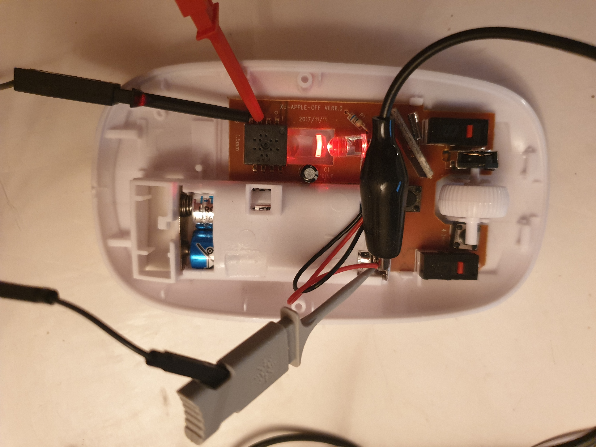

# Mouse-Sensor-Hack

---

Hacking KA8 sensors

Created by [Jean Perardel](http://www.instructables.com/member/jeanotP1314/) from [Lab_1314](https://www.youtube.com/watch?v=qNliaFjvuI0&t=1s).

Status: *** In development ***

---

## Content

I bought several cheap mouses from Ebay and all the sensors seems to have "KA8" written on it... After researches, it seems that it correspond to the chip PAW3204DB. 
Most website show only the 5 first pages of the datasheet, you can find the complete one here : http://www.icpdf.com/PIXART_datasheet/PAW3204DB_pdf_7295136/PAW3204DB_1.html

It seem that we can't visualize the camera pixel on this chip... So for now we will only play with motions datas. 

Here is the Pinout

First : wiring the channel SDIO and Clock

Here are the original datas on the sensors. 
In blue we have the Clock (2 bytes) and in yellow the datas. On the first byte, the controller is sending the register number for reading. (0x02) 
On the second byte, the sensor answer 0x84. The 8 mean "mouvement datas available" and the 4 is the actual resolution (bin 100 = 1000 CPI) 

After a bit of code, I cut the lines between the controller and the sensor and wired directly my Teensy 3.2 board to the sensor. 
Here is the signals : 

And when I read the X and Y register I get this output on serial

